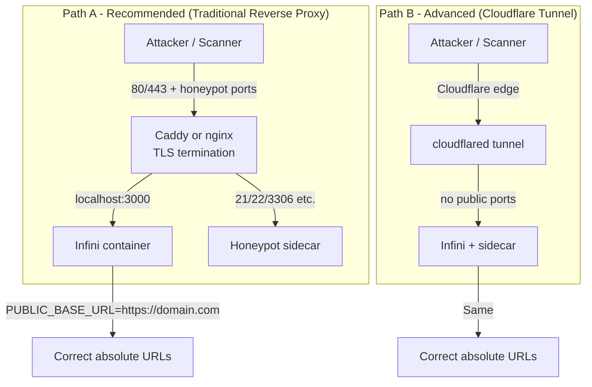

# Production Deployment: Reverse Proxy, Domain & Cloudflare Tunnel

This guide shows how to expose Infini safely on the public internet with a real domain and TLS, while maximizing honeypot effectiveness.

## Contents

- [Architecture Overview](#architecture-overview)
- [Visibility Trade-off](#visibility-trade-off)
- [Recommended Path: Traditional Reverse Proxy (Caddy or nginx)](#recommended-path-traditional-reverse-proxy-caddy-or-nginx)
- [Advanced Path: Cloudflare Tunnel](#advanced-path-cloudflare-tunnel)
- [Required Environment Changes](#required-environment-changes)
- [Firewall Rules](#firewall-rules)
- [Health Checks and Proxy Headers](#health-checks-and-proxy-headers)

## Which deployment path should I choose?

Use this decision flowchart to pick the right setup for your situation. It covers the three common scenarios: local testing, public with maximum honeypot visibility, and public while hiding your real server IP.

```mermaid
flowchart TD
    Start([Start here]) --> Q1{Is this for local learning,<br/>testing, or LAN-only use?}

    Q1 -->|Yes| Local[LAN / Local Only<br/>Use default docker compose up<br/>Access via localhost or HOST_PORT<br/>No domain or TLS needed<br/>Safest for beginners]

    Q1 -->|No| Q2{Do you have a domain name<br/>and want a public HTTPS site?}

    Q2 -->|No| Local

    Q2 -->|Yes| Q3{Do you need to hide the real<br/>server IP address from attackers?}

    Q3 -->|No| Public[Public with Maximum Visibility<br/>Recommended for most honeypot users<br/>VPS + Caddy or nginx reverse proxy<br/>Open ports 80/443 + honeypot ports (21, 22, 3306...)<br/>Highest scanner and Shodan hits<br/>Origin IP is visible]

    Q3 -->|Yes| Tunnel[Public with Hidden Origin IP<br/>Cloudflare Tunnel (cloudflared)<br/>No public ports open except the tunnel<br/>Strong OPSEC / compliance needs<br/>Lower automated scanner visibility<br/>Still works with a custom domain]

    Local --> End1[Follow Quick Start in README<br/>or getting-started.md]
    Public --> End2[Follow Path A in this guide<br/>Set PUBLIC_BASE_URL, ENFORCE_HTTPS, etc.]
    Tunnel --> End3[Follow Path B in this guide<br/>Create tunnel in Cloudflare Zero Trust dashboard]

    classDef decision fill:#fef3c7,stroke:#d97706
    classDef endNode fill:#d1fae5,stroke:#059669
    class Q1,Q2,Q3 decision
    class Local,Public,Tunnel,End1,End2,End3 endNode
```

**Quick decision guide**

- **LAN only / learning** — Choose the left branch. Zero extra setup. Perfect for understanding lures and the Security Hub before going public.
- **Public + maximum honeypot data** — Choose the middle branch (traditional reverse proxy). This is the recommended path for most people because it keeps standard ports open so automated scanners find your lures.
- **Public + hide real IP** — Choose the right branch (Cloudflare Tunnel). Use this when OPSEC or compliance requires hiding the origin. Be aware that many mass scanners will miss the honeypot.

After you decide, continue to the Architecture Overview and the step-by-step instructions for your chosen path.

## Architecture Overview

Two supported production paths exist. The default single-container developer experience (`docker compose up`) remains unchanged.



## Visibility Trade-off

| Aspect                        | Path A (Reverse Proxy on VPS)                  | Path B (Cloudflare Tunnel)                     |
|-------------------------------|------------------------------------------------|------------------------------------------------|
| Scanner / Shodan visibility   | High — standard ports are open and indexed     | Low — many tools do not follow Cloudflare origins |
| Origin IP exposed             | Yes (VPS IP is public)                         | No (tunnel hides the origin)                   |
| Honeypot effectiveness        | Maximum                                        | Reduced for automated mass scanners            |
| TLS termination               | Caddy/nginx on host                            | Cloudflare edge                                |
| Recommended for               | Maximum lure hits and research data            | Strong OPSEC requirements                      |

**Recommendation**: Use Path A unless you have a specific need to hide the origin IP. Most honeypot value comes from automated scanners discovering the lures on standard ports.

## Recommended Path: Traditional Reverse Proxy (Caddy or nginx)

### Prerequisites
- A VPS or server with a public IP and domain pointing to it (A record).
- Ports 80 and 443 open (plus honeypot ports you want exposed: 21, 22, 3306, etc.).

### Using Caddy (simplest)

1. Install Caddy on the host:
   ```bash
   sudo apt install -y debian-keyring debian-archive-keyring apt-transport-https
   curl -1sLf 'https://dl.cloudsmith.io/public/caddy/stable/gpg.key' | sudo gpg --dearmor -o /usr/share/keyrings/caddy-archive-keyring.gpg
   echo "deb [signed-by=/usr/share/keyrings/caddy-archive-keyring.gpg] https://dl.cloudsmith.io/public/caddy/stable/deb/debian any-version main" | sudo tee /etc/apt/sources.list.d/caddy.list
   sudo apt update && sudo apt install caddy
   ```

2. Create `/etc/caddy/Caddyfile`:
   ```caddy
   honeypot.example.com {
       reverse_proxy localhost:3000
   }

   # Optional: expose honeypot ports directly or via separate blocks if needed
   ```

3. Enable and start:
   ```bash
   sudo systemctl enable --now caddy
   ```

Caddy automatically obtains and renews Let's Encrypt certificates.

### Using nginx

Create `/etc/nginx/sites-available/infini`:
```nginx
server {
    listen 80;
    server_name honeypot.example.com;
    return 301 https://$server_name$request_uri;
}

server {
    listen 443 ssl http2;
    server_name honeypot.example.com;

    ssl_certificate /etc/letsencrypt/live/honeypot.example.com/fullchain.pem;
    ssl_certificate_key /etc/letsencrypt/live/honeypot.example.com/privkey.pem;

    location / {
        proxy_pass http://localhost:3000;
        proxy_set_header Host $host;
        proxy_set_header X-Real-IP $remote_addr;
        proxy_set_header X-Forwarded-For $proxy_add_x_forwarded_for;
        proxy_set_header X-Forwarded-Proto $scheme;
    }
}
```

Enable the site and obtain certificates with Certbot if needed.

## Advanced Path: Cloudflare Tunnel

This hides your origin IP completely. Use only when OPSEC is more important than maximum scanner coverage.

1. Create a Cloudflare Tunnel in the Zero Trust dashboard.
2. Install `cloudflared` on your server.
3. Run the tunnel pointing to your Docker network (or localhost if using host networking):
   ```bash
   cloudflared tunnel run --url http://localhost:3000 your-tunnel-name
   ```
4. In the Cloudflare dashboard, create a public hostname (e.g. `honeypot.example.com`) that routes to the tunnel and the service `http://localhost:3000`.
5. For honeypot ports (MySQL, SSH, etc.), create additional public hostnames or use Cloudflare Spectrum (paid) if you need TCP proxying.

**Important**: Many automated scanners and Shodan-style indexers do not follow Cloudflare Tunnel origins, so your MySQL `password_backup` table and other lures will receive far fewer hits.

## Required Environment Changes

Edit `.env` (or use an override) for any domain-based deployment:

```bash
PUBLIC_BASE_URL=https://honeypot.example.com
PUBLIC_SITE_ORIGIN=https://honeypot.example.com
ENFORCE_HTTPS=true
COOKIE_SECURE=true
CORS_ORIGINS=https://honeypot.example.com
```

These ensure absolute URLs, secure cookies, and correct redirect behavior.

## Firewall Rules

Only allow the ports you actually need:

```bash
# Web + TLS
sudo ufw allow 80/tcp
sudo ufw allow 443/tcp

# Honeypot services you chose to expose on standard ports
sudo ufw allow 21/tcp comment 'FTP honeypot'
sudo ufw allow 22/tcp comment 'SSH honeypot (Cowrie)'
sudo ufw allow 3306/tcp comment 'MySQL honeypot'
# etc.

sudo ufw enable
```

When using Cloudflare Tunnel you can close all ports except the tunnel itself (usually outbound only).

## Health Checks and Proxy Headers

Infini already sets `app.set('trust proxy', 1)`, so `X-Forwarded-For` works correctly behind one reverse proxy.

The Docker healthcheck in `docker-compose.yml` uses `http://localhost:3000/api/health`. This continues to work even when a reverse proxy is in front.

Update any monitoring that expects port 3000 to use the public domain instead.

This setup gives you a production-grade, TLS-terminated deployment while preserving the honeypot's ability to attract real attackers.